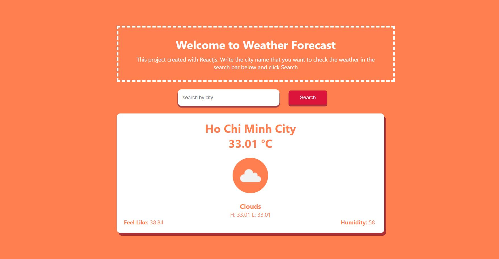
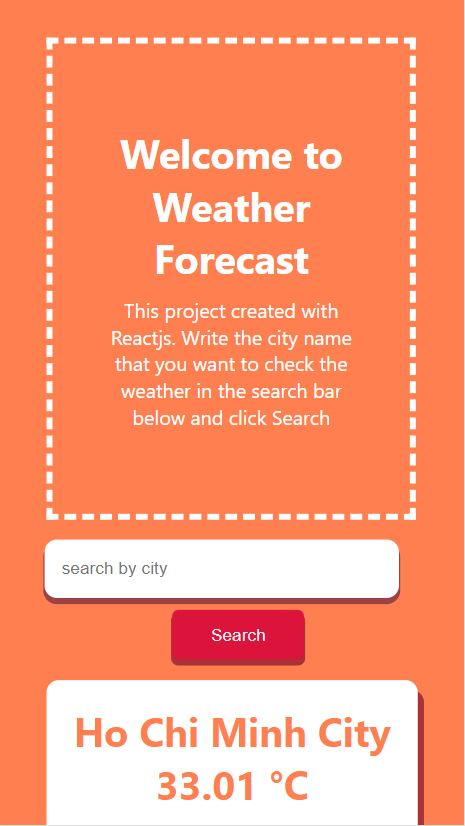

# WEATHER APPLICATION - REACT - REACTHOOK - REACT ROUTER

## Introduction
This project was made in react, fetch data from weather API in https://openweathermap.org/api
### The project is deployed in Netlify : https://magenta-buttercream-07d25c.netlify.app/

I made this project to practice fetching data from API after 1 day learning at school. I use react hook to let user searching by term to search their city they want to check the temperature. I also use axios to get the data from the server. The project also take care of the responsible

### TOOL USING:
+ React, react-hook, react-router-dom
+ useState, useEffect
+ Axios
+ Nodejs, Expressjs
+ HTML / CSS

## SCREENSHOTS

### mobile screen

